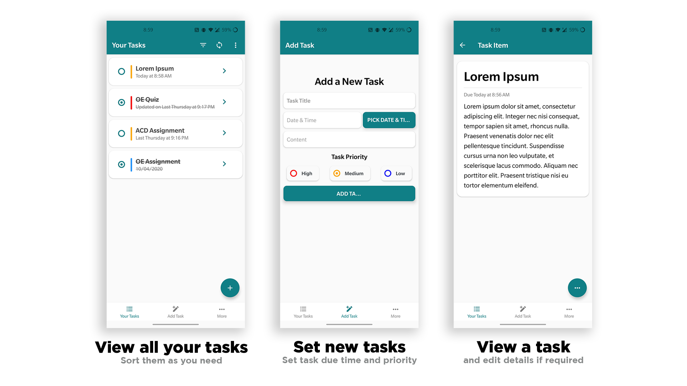

# Shigoto

> A free and open source task manager application for Android/IOS built with React Native (Expo CLI)

## Features

-   [x] Signup and login with your account
-   [x] Add, Edit, Update and Delete tasks
-   [x] Mark completed when finished
-   [x] Sort tasks as per your need
-   [x] Works on both IOS and Android devices
-   [x] All data is stored on cloud storage

## Screeshots



## Todo (In Progress)

-   [ ] Dark theme support
-   [ ] Build a web client to sync your tasks/reminders across devices

## Get Started

#### 1. Clone the Repo

On the terminal run the following commands

```sh
$ git clone https://github.com/rajarsheechatterjee/Shigoto.git

$ cd Shigoto

$ npm  OR expo install (to install all dependencies )

$ expo start

```

## License

[MIT ](https://github.com/rajarsheechatterjee/Shigoto/blob/master/LICENSE)
