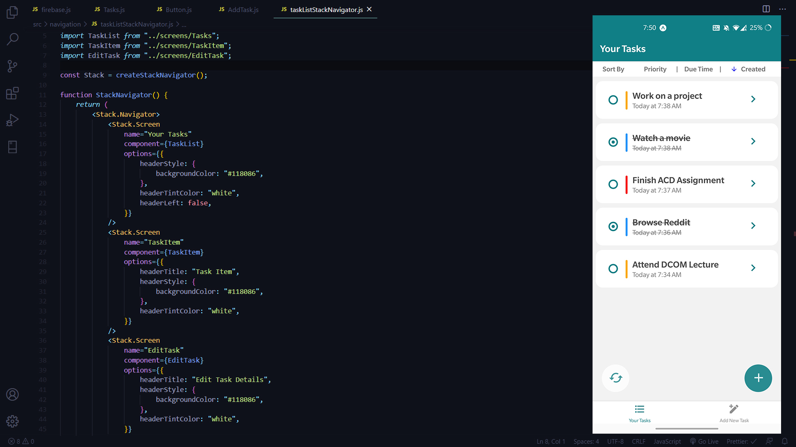
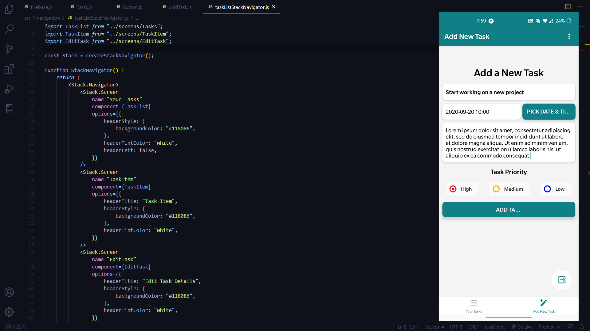
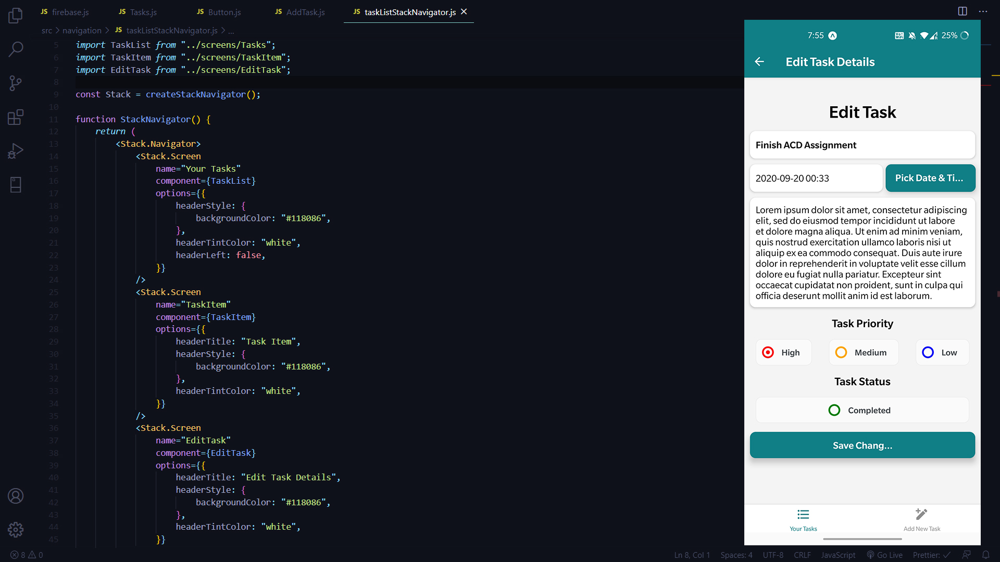

# Shigoto
>Free and open source task manager/reminder application for Android/IOS built with React Native (Expo CLI)

## Features
- [x] Signup and login with your account
- [x] Add new tasks
- [x] Edit/Update tasks
- [x] Mark completed when finished
- [x] Sort tasks by priority, due time and created at
- [x] Delete tasks
- [x] Works on both iPhone and Android devices
- [x] All data is stored on firebase cloud storage

##  Your Tasks


##  Add Tasks


##  Edit Tasks


 ## Todo (In Progress)
- [ ] Dark theme support and add more options for accent color 
- [ ] Build a web client to sync your tasks/reminders across devices
- [ ] Add multiple collaborators who recieve the task reminder at the specified time

 ## Get Started
 
 #### 1. Clone the Repo
 
 On the terminal run the following commands
 ```sh
 $ git clone https://github.com/rajarsheechatterjee/Shigoto.git
 
 $ cd Shigoto
 
 $ npm  OR expo install (to install all dependencies )

 $ expo start
 
 ```
 ## License
 
 [MIT ](https://github.com/rajarsheechatterjee/Shigoto/blob/master/LICENSE)
